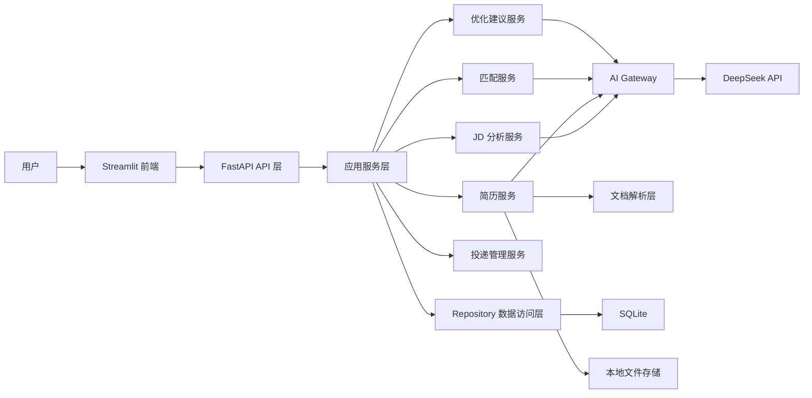

# AI Internship Hunter Agent 系统设计报告

## 项目背景

实习求职过程中，用户通常需要反复阅读岗位描述（Job Description，简称 JD）、判断自身经历是否符合要求、针对不同岗位调整简历，并持续跟踪投递和面试状态。这些工作信息分散、重复度高，而且容易受到主观判断影响。

AI Internship Hunter Agent 旨在利用大语言模型的语义理解能力，结合确定性规则和结构化数据管理，为求职者提供一套本地可运行、可追溯、可逐步扩展的求职辅助工具。

项目首个版本定位为“求职决策辅助系统”，暂不实现招聘网站自动登录、自动采集或自动投递，以降低账号安全、平台合规、验证码处理及隐私泄露风险。

## 项目目标

项目需要实现以下四项核心能力：

1. **JD 岗位分析**：从岗位描述中提取职责、必备技能、加分技能、学历、经验、语言和其他约束。
2. **简历匹配**：将指定简历版本与目标岗位进行多维度比较，输出匹配分数、匹配证据和能力差距。
3. **简历优化建议**：针对目标岗位提供内容、表达和关键词方面的修改建议，同时禁止虚构用户经历。
4. **投递记录管理**：记录岗位、投递时间、使用的简历版本、当前状态、面试事件和后续行动。

首阶段目标是完成单用户、本地运行的最小可用产品（MVP），保证架构清晰、数据可追溯，并为后续多用户、云端部署和外部工具集成保留扩展空间。

## 用户需求

### 核心用户流程

1. 用户创建个人资料并上传简历。
2. 系统提取简历文本，生成结构化简历信息。
3. 用户粘贴 JD，并补充公司、岗位名称和岗位链接等信息。
4. 系统分析 JD，识别硬性要求、加分要求和关键词。
5. 用户选择一个简历版本与岗位进行匹配。
6. 系统展示总分、分项得分、匹配证据、缺失要求和投递建议。
7. 系统基于差距生成简历优化建议，由用户决定是否采纳。
8. 用户创建投递记录，并持续更新测评、面试、Offer 或拒绝等状态。

### 功能需求

| 功能域 | 主要输入 | 主要输出 |
| --- | --- | --- |
| JD 分析 | JD 原文、公司、岗位名称、链接 | 结构化要求、职责、关键词、岗位级别 |
| 简历管理 | PDF、DOCX 或 TXT 简历 | 原始文本、结构化信息、简历版本 |
| 简历匹配 | JD 分析结果、简历版本 | 总分、分项得分、匹配项、差距、证据 |
| 优化建议 | 匹配报告、简历内容 | 修改建议、理由、优先级、推荐表达 |
| 投递管理 | 岗位、简历版本、投递信息 | 状态、事件时间线、提醒日期、统计数据 |

### 非功能需求

- DeepSeek API Key 通过环境变量读取，不写入源码或版本库。
- 简历正文、联系方式等敏感数据不进入普通应用日志。
- 上传文件必须限制类型、大小和文本长度。
- AI 输出必须进行结构化校验、分数范围校验和异常处理。
- 所有 AI 结论应尽可能提供 JD 或简历中的证据来源。
- 支持数据备份、导出和删除。
- 对相同输入可进行缓存，记录请求耗时和 Token 使用量。
- 前端不直接访问数据库或调用 DeepSeek API。

## 系统整体架构

项目采用模块化单体架构。Streamlit 负责用户交互，FastAPI 提供统一接口，应用服务层负责编排业务流程，Repository 层隔离 SQLite，所有模型调用统一经过 AI Gateway。



### 分层职责

- **Streamlit 前端**：页面展示、文件上传、表单输入、状态展示以及 FastAPI 调用。
- **FastAPI API 层**：请求校验、路由管理、错误处理和统一响应。
- **应用服务层**：编排 JD 分析、简历解析、匹配、优化和投递管理流程。
- **AI Gateway**：统一处理模型配置、结构化输出、重试、超时、日志脱敏和成本记录。
- **文档解析层**：负责 PDF、DOCX、TXT 的本地文本提取与清洗。
- **Repository 层**：封装数据查询与事务，避免业务层直接编写 SQL。
- **持久化层**：SQLite 保存结构化业务数据，本地文件目录保存简历和导出文件。

## 技术选型

| 技术 | 用途 | 选择理由 |
| --- | --- | --- |
| Python | 主要开发语言 | AI、文档解析和 Web 生态成熟 |
| FastAPI | 后端 API | 类型提示友好，支持自动接口文档和请求校验 |
| Streamlit | Web 前端 | 适合快速构建数据与 AI 应用界面 |
| SQLite | MVP 数据库 | 无需独立服务，便于本地开发和单用户使用 |
| SQLAlchemy | 数据访问与 ORM | 隔离数据库实现，便于后续迁移 PostgreSQL |
| Pydantic | 数据校验 | 统一校验 API 请求、响应和 AI 结构化结果 |
| OpenAI Python SDK | 大模型访问 | 通过 OpenAI 兼容接口调用 DeepSeek API |
| pypdf / python-docx | 文档解析 | 在本地提取 PDF 和 DOCX 文本，降低模型调用成本 |
| pytest | 自动化测试 | 覆盖服务、API、数据访问和 Prompt 回归测试 |

MVP 不引入微服务、消息队列或向量数据库。只有在用户规模、并发量或检索需求明确增长后，再评估 PostgreSQL、Redis、任务队列和向量检索方案。

## Agent设计

系统初期采用“单一业务 Agent + 专用任务模块”的方式，不让一个大型 Prompt 同时处理全部功能。Agent 负责理解任务和编排步骤，各能力通过独立、可版本化的 Prompt 完成。

### Agent 能力模块

| 模块 | 职责 |
| --- | --- |
| JD Analysis Agent | 将岗位原文转换为结构化岗位要求 |
| Resume Extraction Agent | 辅助识别简历中的教育、经历、项目、技能和证书 |
| Matching Agent | 对规则匹配结果进行语义补充，解释优势与差距 |
| Optimization Agent | 生成针对目标岗位的简历修改建议 |
| Application Assistant | 根据用户操作管理投递状态和事件，不自主对外投递 |

### Agent 约束

- 不虚构项目、实习、技能、证书、成果数字或任职时间。
- 缺少事实或量化结果时，向用户提示需要补充，而不是自行生成。
- 匹配结论必须关联简历或 JD 证据；无法定位证据时降低置信度。
- 硬性条件优先由确定性规则判断，AI 主要负责语义归纳和解释。
- AI 输出必须符合预定义结构，并由 Pydantic 模型校验后才能进入业务流程。
- 提示词、模型名称和分析版本应被记录，以便复现和回归测试。
- 模型调用失败时提供可理解的错误，并允许重试或降级到规则结果。

### 匹配评分建议

| 维度 | 建议权重 |
| --- | ---: |
| 必备技能 | 30% |
| 工作或实习经历 | 20% |
| 项目经历 | 15% |
| 教育背景 | 10% |
| 加分技能 | 10% |
| 关键词覆盖 | 10% |
| 语言、证书、地点等约束 | 5% |

以上权重应配置化，并通过真实样本持续校准。匹配分仅代表辅助评估结果，不等同于录用概率。

## 数据流设计

### JD 分析数据流

1. 用户通过 Streamlit 提交 JD 和岗位基本信息。
2. FastAPI 校验文本长度和必要字段。
3. 岗位服务保存原始 JD。
4. AI Gateway 调用 JD 分析任务并请求结构化输出。
5. 系统校验字段、枚举和列表格式。
6. 保存 `JobAnalysis`，返回前端展示。

### 简历解析与匹配数据流

1. 用户上传 PDF、DOCX 或 TXT 文件。
2. 系统校验文件类型、大小和文件名。
3. 文档解析层在本地提取并清洗文本。
4. 简历服务保存原始文件、文本和结构化结果，形成一个 `ResumeVersion`。
5. 用户选择简历版本和目标岗位发起匹配。
6. 匹配服务先执行关键词、约束和规则评分。
7. Matching Agent 补充语义判断、证据和解释。
8. 服务合并结果、计算总分并保存 `MatchReport`。

### 优化与投递数据流

1. Optimization Agent 读取简历版本、JD 分析和匹配报告。
2. 系统生成内容、表达和定制化建议，并标记优先级。
3. 用户确认建议，原始简历不会被自动覆盖。
4. 用户创建投递记录，关联岗位、简历版本和匹配报告。
5. 每次状态变化或面试记录新增为 `ApplicationEvent`，形成可追溯时间线。

## 数据库设计

### 核心实体

| 实体 | 主要字段示例 | 说明 |
| --- | --- | --- |
| `UserProfile` | 姓名、求职方向、技能、地点偏好 | 用户基本资料和求职偏好 |
| `Resume` | 标题、创建时间 | 一份逻辑简历 |
| `ResumeVersion` | 文件路径、原文、解析结果、版本号 | 简历的具体版本 |
| `Company` | 名称、官网、备注 | 公司基础信息 |
| `JobPosting` | 公司、岗位名称、链接、原始 JD | 目标岗位 |
| `JobAnalysis` | 技能、职责、约束、关键词、分析版本 | JD 结构化结果 |
| `MatchReport` | 总分、分项得分、证据、差距、置信度 | 简历与岗位的匹配结果 |
| `OptimizationReport` | 建议、理由、优先级、事实提示 | 针对匹配报告的优化建议 |
| `Application` | 岗位、简历版本、状态、投递日期 | 投递主记录 |
| `ApplicationEvent` | 事件类型、时间、备注、下一步日期 | 状态和面试时间线 |
| `AIRequestLog` | 任务类型、模型、耗时、Token、状态 | 脱敏后的模型调用记录 |

### 主要关系

```text
Resume 1 ── N ResumeVersion
Company 1 ── N JobPosting
JobPosting 1 ── N JobAnalysis

ResumeVersion + JobPosting ── N MatchReport
MatchReport 1 ── N OptimizationReport

Application ── JobPosting
Application ── ResumeVersion
Application ── MatchReport
Application 1 ── N ApplicationEvent
```

### 投递状态建议

```text
感兴趣 → 准备中 → 已投递 → 测评 → 面试中
                         ├→ Offer
                         ├→ 拒绝
                         └→ 已撤回
```

数据库应使用迁移机制维护结构变化。AI 原始响应和敏感全文不应无条件写入日志；确需保存时，应设置用途、访问范围和清理策略。

## API设计

API 使用 REST 风格，统一采用 JSON 响应；文件上传接口使用 `multipart/form-data`。API 层只负责协议和校验，业务逻辑由服务层完成。

### 路由规划

| 路由前缀 | 主要用途 |
| --- | --- |
| `/health` | 服务健康检查 |
| `/profiles` | 用户资料与求职偏好 |
| `/resumes` | 简历上传、查询和版本管理 |
| `/jobs` | 公司与岗位管理 |
| `/analyses` | 创建和查询 JD 分析结果 |
| `/matches` | 创建和查询简历匹配报告 |
| `/optimizations` | 创建和查询简历优化建议 |
| `/applications` | 投递记录、状态和事件管理 |
| `/dashboard` | 投递统计和待办摘要 |

### 代表性接口

| 方法 | 路径 | 用途 |
| --- | --- | --- |
| `GET` | `/health` | 检查服务是否可用 |
| `POST` | `/resumes` | 上传一份简历 |
| `GET` | `/resumes/{resume_id}` | 查询简历及其版本 |
| `POST` | `/jobs` | 创建岗位记录 |
| `POST` | `/jobs/{job_id}/analyses` | 分析指定岗位 JD |
| `POST` | `/matches` | 对简历版本和岗位执行匹配 |
| `POST` | `/matches/{match_id}/optimizations` | 生成定向优化建议 |
| `POST` | `/applications` | 创建投递记录 |
| `PATCH` | `/applications/{application_id}` | 更新投递状态或信息 |
| `POST` | `/applications/{application_id}/events` | 添加面试或状态事件 |

所有接口应使用统一错误结构，区分输入错误、资源不存在、文件解析失败、AI 服务不可用和内部错误。创建 AI 分析任务时应考虑超时、幂等和重复请求缓存。

## 后续开发规划

### 第一阶段：基础数据与文件能力

- 完善配置、日志、异常处理和数据库会话。
- 建立 SQLAlchemy 模型、Repository 和数据库迁移。
- 实现简历上传、文件校验、文本提取和版本管理。
- 完成对应的单元测试和 API 测试。

### 第二阶段：JD 分析与匹配

- 实现 DeepSeek LLM Gateway 和结构化输出校验。
- 建立独立、可版本化的 JD 分析 Prompt。
- 实现规则评分、语义匹配和证据定位。
- 使用固定样本建立 Prompt 回归测试与评分校准集。

### 第三阶段：优化建议与投递管理

- 实现针对 JD 的简历优化建议。
- 增加事实核验标记和用户确认流程。
- 实现投递记录、状态流转、事件时间线和筛选统计。
- 完成 Streamlit 主要页面和后端 API 对接。

### 第四阶段：质量与部署

- 增加缓存、重试、Token 和成本统计。
- 完善日志脱敏、数据导出、删除和备份机制。
- 补充 Docker 部署、环境检查和端到端测试。
- 根据真实使用反馈调整匹配权重和 Prompt。

### 可选增强方向

- 扫描版 PDF OCR。
- 多用户认证与数据隔离。
- PostgreSQL、Redis 和异步任务队列。
- 邮件或日历提醒。
- 定制简历导出与多语言支持。
- 在符合平台条款和用户明确授权的前提下接入外部招聘服务。
